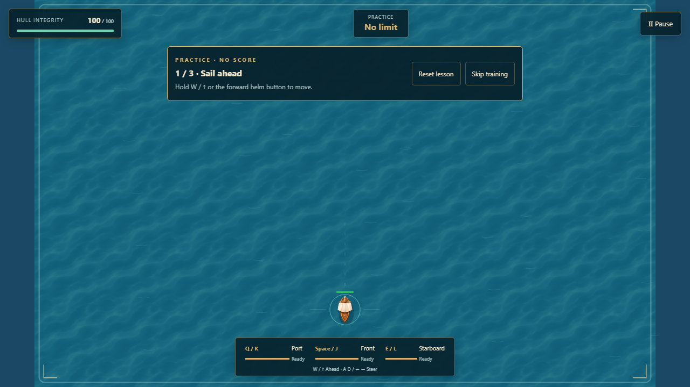
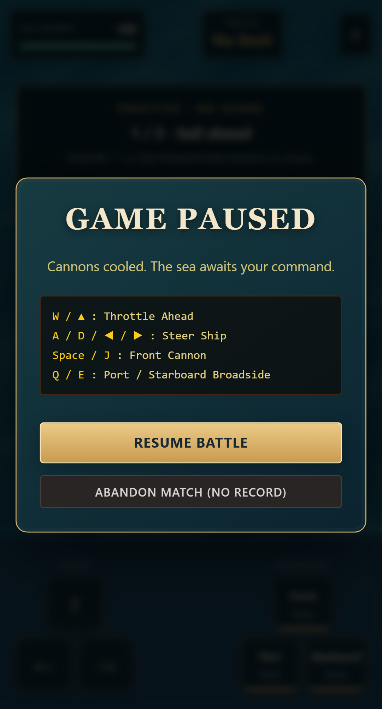

# Quiet exits and reliable pause audio, 7 October 2026

A slow ambient-sound download could start playing after the captain had already abandoned the match. The same race could start full-volume ocean ambience while the pause dialog was open. Both happened because asynchronous loop loading ignored later stop and volume commands.

`AudioManager` now records each pending loop request. Exit cancels pending starts as well as active loops. A stale completion cannot start or replace a newer voyage's loop. Repeated starts during one pending request share that request. Pause/resume volume changes update the pending request, so playback begins at the current volume. Successfully downloaded buffers remain reusable by the next voyage; failed loads allow a fresh request.

## Local checks

- A controlled delayed-download unit test failed before the fix: a source was created after `stopAllLoops`. It passes with the fix.
- All 296 unit tests across 28 files passed. Seven new cases cover exit before load, cached restart, duplicate pending starts, independent loop cancellation, both old/new completion orders, retry after failure and pause volume changes.
- Frontend and Pages Functions TypeScript checks and the optimized build passed with mocks disabled.
- Four browser checks passed against the production build, across desktop and mobile Chromium. They delay the actual WAV response, inspect real Web Audio loop/gain state after exit and pause, then verify restart and resume. Practice avoids ranked backend traffic. The checks reject a development build or MSW widget. These are state and connection checks, not an acoustic listening assessment.
- Desktop restart and portrait pause screenshots were inspected. Both states remain usable. Screenshots supplement the audio assertions; they cannot establish silence by themselves.
- Twenty existing browser checks passed, with two expected desktop skips for mobile controls. They cover termination/restart, pause/blur, abandonment, touch input, focus, teardown and all six unchanged Windows visual baselines.





## Retention diagnostic

The combat profiler now supports `PROFILE_CYCLE_SECONDS` and uses weak references to observe retired simulations, Pixi games, applications and canvases without keeping those objects alive. Reports include the index of any surviving simulation, DOM/listener counts, forced-GC heap readings, and a final ten-second idle check. This separates accumulating old instances from a surviving latest instance. It does not identify every retained object or measure GPU memory.

A pre-fix run measured 60 seconds of optimized Classic combat, followed by twenty ten-second play/abandon cycles. It recorded about 144 frames per second with a 7.1 ms 95th-percentile frame interval on this desktop host. No runtime errors occurred. Every exit removed the canvas and both debug handles, and weak references observed zero surviving games, applications or canvases. One simulation survived each immediate check. DOM nodes and event listeners stayed at 262 and 195 after the first cycle. Heap grew from 7.21 MB at cycle one to 8.37 MB at cycle twenty, with the last five cycles between 8.33 and 8.44 MB. This suggests bounded warmup in this sample, but does not prove the source of every allocation or zero leakage.

The post-fix run completed the same 60-second combat measurement and twenty ten-second cycles, then ten seconds idle. It also recorded about 144 frames per second and a 7.1 ms 95th-percentile frame interval, with no runtime errors. Heap rose from 7.18 MB after cycle one to 8.38 MB after cycle twenty, and settled at 8.37 MB after idle. These readings do not demonstrate a performance improvement; the fix addresses the delayed playback race.

Each post-fix exit collected all previously observed games, applications and canvases. Exactly one simulation remained alive: index one after cycle one, index two after cycle two, continuing to index twenty at the end and after idle. Older simulations collected as new cycles replaced them, so this sample does not show accumulating simulation instances. The retaining path for the latest simulation has not been established. Nodes stayed at 262; listeners stayed at 195 during cycles and dropped to 190 after idle. This remains a bounded desktop diagnostic, not an unrestricted memory-stability guarantee.

The full reports are `artifacts/lifecycle/extended-before.json` and `artifacts/lifecycle/extended-after.json`. A [portable summary of both runs](lifecycle-profile.json) preserves the configuration, frame results, first/last exits and final idle observations.

Reproduce with a production preview on port 4186:

```powershell
$env:VITE_USE_MSW='false'
npm.cmd run build
npm.cmd run preview -- --host 127.0.0.1 --port 4186 --strictPort
```

In a second terminal:

```powershell
$env:PLAYWRIGHT_PORT='4186'
$env:EXPECT_PRODUCTION_BUILD='true'
npx.cmd playwright test tests/e2e/20_audio_loop_lifecycle.spec.ts
$env:PROFILE_URL='http://127.0.0.1:4186'
$env:PROFILE_SECONDS='60'
$env:PROFILE_CYCLES='20'
$env:PROFILE_CYCLE_SECONDS='10'
$env:PROFILE_OUTPUT='artifacts/lifecycle/extended-after.json'
node tools/profile-combat.mjs
```

The profiler supplies a local diagnostic session ticket, blocks score submission, protects hull health, and uses scripted combat input. Its results are not physical-phone performance. Artifacts are ignored by Git. These changes and checks remain local; deployment and remote CI have not been verified for this iteration.

The requested [web-perf skill](C:/Users/lives/.codex/skills/web-perf/SKILL.md) audit still cannot run because Chrome DevTools MCP tools are unavailable. Its instruction says: "If unavailable, STOP-the chrome-devtools MCP server isn't configured." The Playwright/CDP runtime diagnostic above is separate evidence, not a Core Web Vitals or Lighthouse audit.
