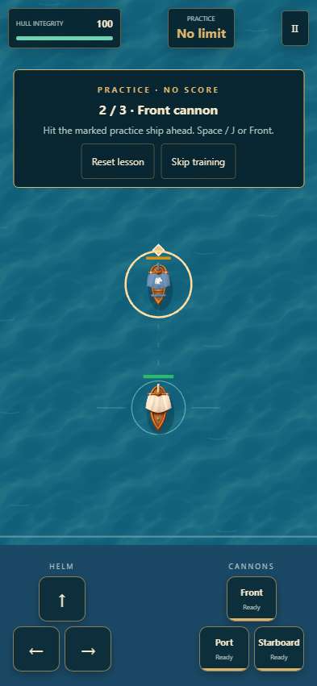
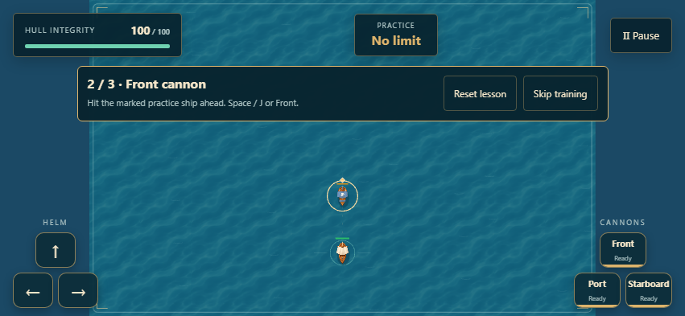

# Game evaluation and improvements

Evaluated locally on 7 October 2026 using the requested Game Studio skills. The existing React/PixiJS 2D naval game already separates simulation, presentation, input, and DOM UI. Its strongest features are independent cannons, readable enemy anticipation, deterministic replay, and a short practice encounter. This pass preserves that work and concentrates on player visibility, recovery, and settings that can actually produce a valid score submission.

The shared foundations, 2D architecture, UI, and playtest guidance apply to this game. The requested Three.js, React Three Fiber, and 3D asset skills were reviewed for applicability. Combat retains its 2D runtime and existing ship/environment artwork. A subsequent art pass uses selected Kenney Pirate Kit models to render static harbor artwork offline; see [the harbor art decision](HARBOR-ART.md).

## Findings fixed

| Priority | Player experience and reproduction | Improvement |
| --- | --- | --- |
| P1 | Select a fractional enemy interval such as 3.5 seconds. The simulation accepts it, but the Pages match endpoint rejects it and the database stores integer intervals. | Options use the full supported 1–15 second range in whole seconds. Older stored fractional menu settings round to the nearest second. Replay configuration validation stays unchanged to preserve older recordings. |
| P2 | Hold forward in portrait until the ship reaches the top of the arena. The camera previously clamped the world flush with the viewport, placing the hull beneath the HUD. | The portrait camera allows sea beyond vertical arena boundaries, keeping the hull below the status strip and above the touch helm. Landscape retains the arena overview. |
| P2 | Open options, pause, or a result with replay on a short landscape screen. Centered overflowing panels can lose their upper content and result actions. | Panels start within the scrollable viewport and center when space is available. Result, pause, and options actions remain reachable at 851×320. |
| P2 | Sail away or steer past a practice target before firing. The lesson has no way to reacquire its starting setup. | Reset lesson restores position, target health, weapon readiness, and input state without scoring or restarting earlier lessons. Keyboard and touch trackers reset together. |
| P2 | Hold P or Escape. Repeated keydown events toggle pause and resume. A movement key still physically held after a reset can also reactivate through browser repeats. | Pause ignores repeated keydown events. Cleared movement/fire keys require release and a fresh press after pause or lesson transitions. |
| P2 | Edit options, cancel, then reopen. The cancelled draft remains in the controls. | Each opening restores the active configuration and clears draft validation errors. |
| P2 | Store a malformed last-result object, then load `/#last-result`. Unvalidated fields can reach rendering and score submission. | Invalid saved result fields return the player to the harbor without submitting a match. Stored data is preserved. |
| P3 | Practice shows a frozen battle timer and score; its landscape instruction panel occupies a large part of the playable area. | Practice clearly says “No limit,” hides meaningless score/time values, and uses a compact horizontal lesson strip in landscape. Completion offers Set Sail or Back to harbor. |

Resize handling also repaints immediately after the WebGL drawing buffer is cleared. The rotation test waits for the renderer to adopt the new dimensions before checking camera state.

Browser recording and report directories are excluded from the development server's watcher. This prevents generated trace HTML from reloading the game during a playtest. Settings assertions wait for the main menu to finish asset loading before inspecting its values.

Subsystem ownership: [camera calculations](../src/pixi/Camera.ts) and [resize rendering](../src/pixi/PixiGame.ts) own visibility; [GameSimulation](../src/core/simulation/GameSimulation.ts) owns lesson recovery; [PixiCanvas](../src/pixi/PixiCanvas.tsx) and [App](../src/App.tsx) own keyboard boundaries. DOM presentation and saved result validation live in `src/ui/`, while [configuration restoration](../src/types/config.ts) normalizes old menu settings.

## Visual review

The portrait practice target and player hull are readable, the target ring remains separate from the lesson panel, and the touch controls stay clear of both ships. Landscape instructions now fit into a narrow strip. The mobile combat baseline was deliberately regenerated and inspected after changing the camera. Desktop, harbor, and result baselines continue to compare without regeneration.





## Verification

Final local validation passed:

- 222 unit tests across 20 files.
- Strict TypeScript checks for the frontend and Pages Functions, plus the production build.
- 61 Playwright scenarios across desktop and emulated mobile Chromium. Five expected desktop skips cover touch/portrait-only checks. The final complete run finished with no failures in 6.6 minutes.
- All six existing menu/combat/result screenshot comparisons. The portrait combat baseline reflects the reviewed camera change.
- Separate rendered capture passes at 1280×720, 393×851, and 851×393, with no page errors. These captures fast-forward the battle ending through fixed simulation ticks.
- Git whitespace checks.

Regression coverage includes lesson recovery, key repeats, short-screen scrolling, cancelled options, legacy fractional settings, corrupt result restoration, and portrait hull clearance. The existing browser suites also cover combat, AI, score rules, pause, offline recovery, replay verification, simultaneous touch input, and screenshot baselines. The complete local [browser report](../artifacts/game-evaluation/verified-report/index.html) is retained for review.

Reproduce local verification:

```sh
npm test
npm run build
npm run test:e2e
```

Full local reports and before/after captures are retained under `artifacts/game-evaluation/` and excluded from Git. Reviewed representative images are included above. Desktop and mobile browser checks use Chromium, with phone behavior emulated. Network flows use the local MSW fixtures. This pass does not establish physical-phone behavior, a live score submission, remote CI status, or a production deployment.
