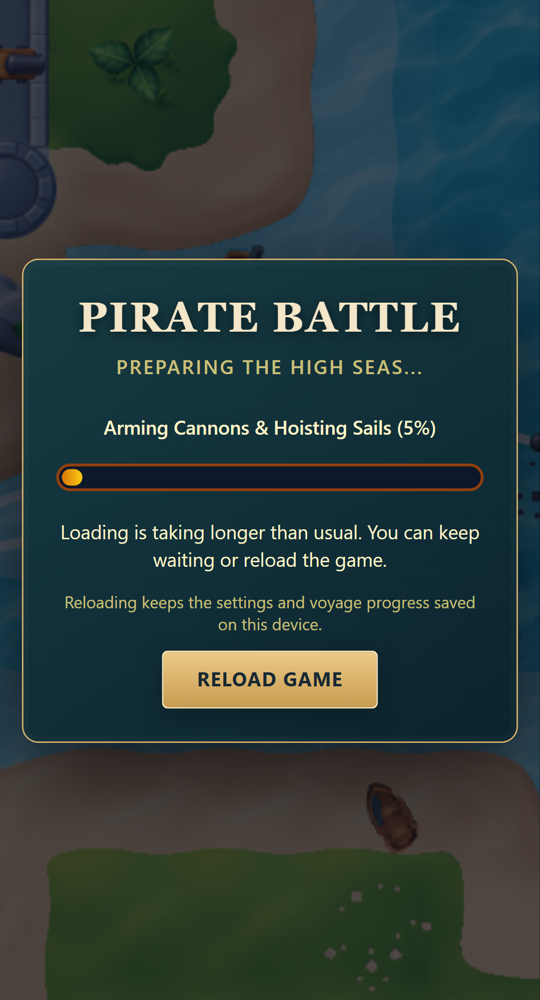
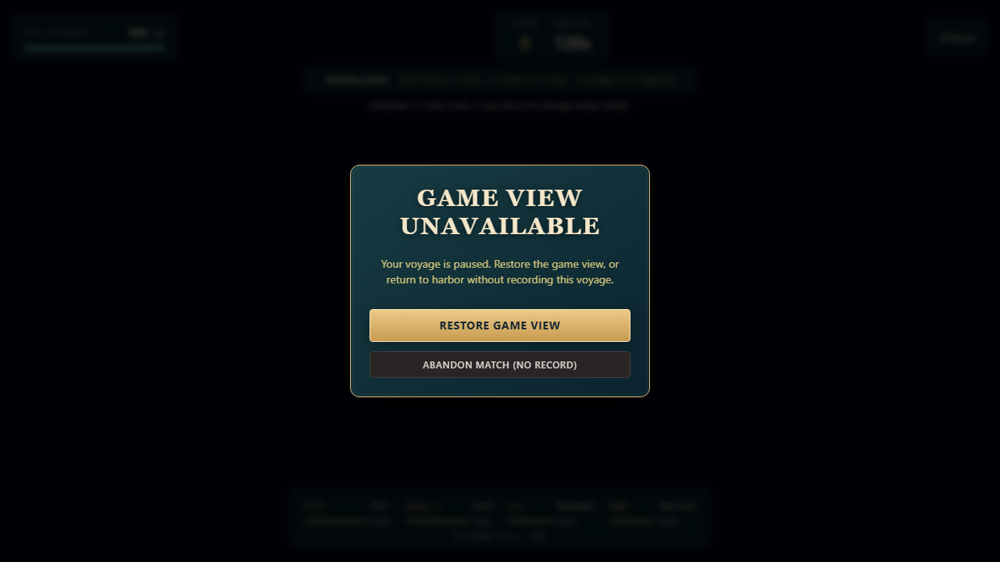

# Recovering an unfinished startup, 7 October 2026

A controlled unfinished spritesheet request reproduced a startup screen stuck at 5% after 16 real seconds. It had no recovery action. A pending graphics initialization likewise had no deadline. These are distinct from a rejected request, which already offered Retry Loading, and from WebGL context loss, which already offered Restore game view.

The asset loading screen now offers **Reload game** after 15 seconds. It keeps loading in the meantime: a late completion opens the harbor without requiring a reload. Reload starts a fresh page and preserves settings and the last battle result already saved in browser storage. It does not promise that unavailable network resources will become available.

Pixi caches pending asset promises. Resetting our loader and retrying the same URL can reuse an unfinished request, and unloading that request also waits for its completion. Reload avoids that cache rather than destroying textures or resetting Pixi's global cache. Ordinary rejected-request retries retain their existing behavior.

The loading panel scrolls on short screens so its recovery action stays reachable. Current preload attempts ignore progress, success and errors from unmounted or superseded React lifetimes. Concurrent subscribers receive the current and subsequent progress updates, including the second StrictMode mount, while sharing the same preload promise.

Graphics initialization now expires after 20 seconds through the existing **Game view unavailable** dialog. The simulation pauses and clears inputs; Restore game view creates a fresh view for the same voyage. Successful restoration remains paused until Resume Battle. The old view cannot announce readiness or failure after its timeout, replacement or unmount. Initialization timers clear on success, failure and cleanup. A Pixi application that finishes initializing after destruction still follows the existing late-resource cleanup path.

These are browser timer deadlines, subject to background-tab throttling. This change adds no simulation or replay rules, score changes, polling loop or automatic reload.

## Validation

The browser fixture deliberately holds the spritesheet fetch or Pixi Application initialization promise. It tests recovery without claiming to diagnose the cause of a real device stall. Regression checks use the delivered battle and preserve saved settings and the last battle result. See the committed reports for final delivery validation.
